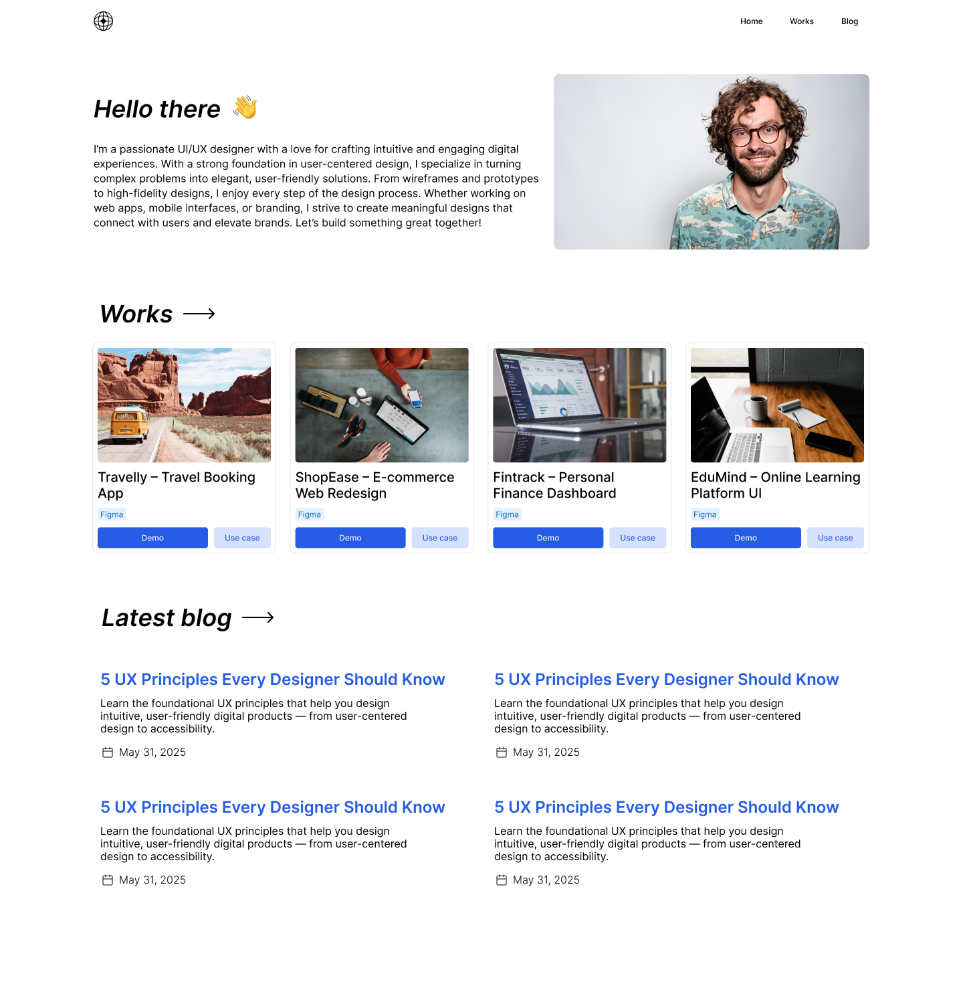

# Personal blog/portfolio website template

Created with Nextjs [Fumadocs](https://fumadocs.dev/) with [Outstatic CMS](https://outstatic.com/)

## Installation

1. Clone the template
2. Install dependecies

   ```bash
   pnpm install
   ```

3. Copy ENV variables

   ```bash
   cp .env.example .env.local
   ```

4. Get your [Oauth keys from github](https://github.com/settings/developers)

[➡ Checkout the documentation](https://outstatic.com/docs/getting-started)
